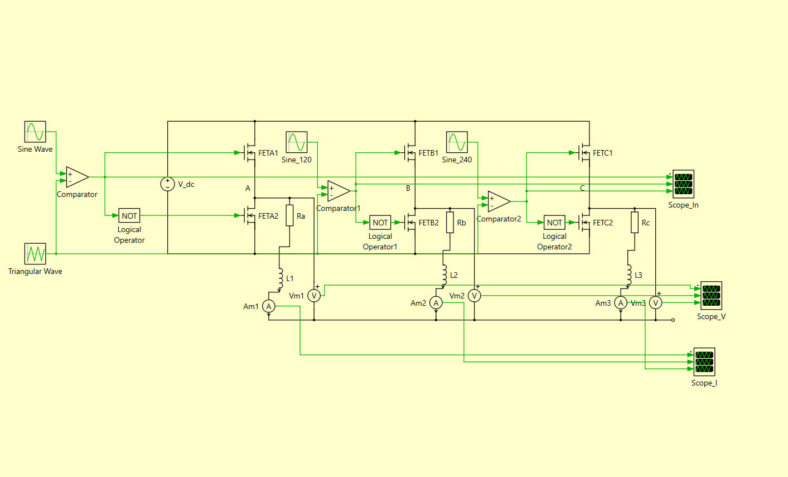
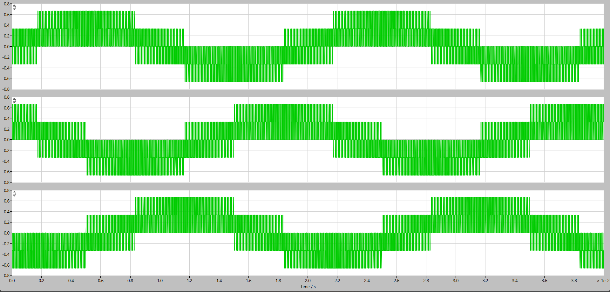
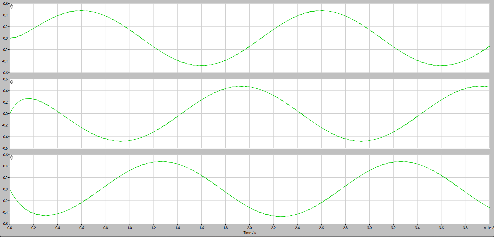
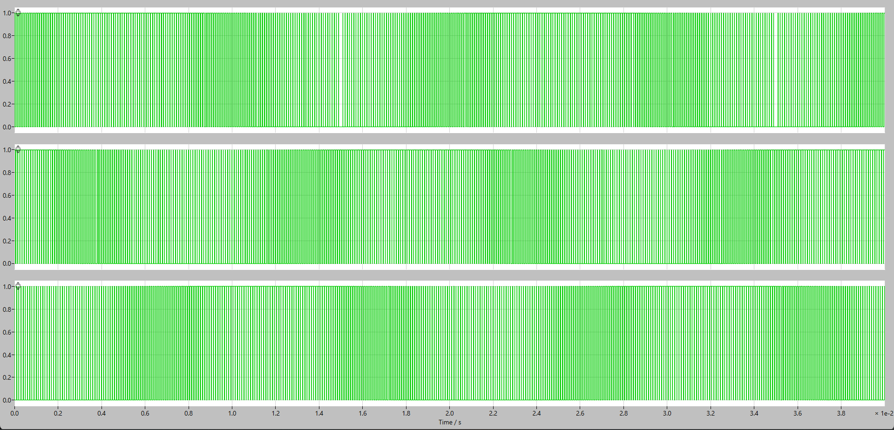

# three-phase-spwm-inverter-sim

Three-phase sinusoidal PWM (SPWM) inverter simulation in PLECS

## Overview

This project implements a three-phase, six-switch inverter using sinusoidal PWM in PLECS. Three sine-wave references, phase-shifted by 120° each, are compared against a common triangular carrier to generate complementary gate signals for each leg of the inverter, producing a balanced three-phase AC output from a DC source.

## Circuit Schematic

Each leg (A, B, C) uses a comparator against the shared triangular carrier, with a NOT gate generating the complementary switch signal for the lower device in the leg.

## Simulation Parameters

| Parameter              | Value                              |
| ----------------------- | ----------------------------------- |
| DC Bus Voltage (Vdc)    | 1 V (normalized)                    |
| Carrier (Triangular Wave) Frequency | 10 kHz                  |
| Reference (Sine Wave) Frequency     | 50 Hz                   |
| Phase Shift             | 120° between phases                 |
| Load                    | Three-phase R-L load (R = 1 Ω, L = 1 mH per phase) |

**Note:** Simulation uses a normalized DC bus voltage (Vdc = 1 V), so output voltage (≈ 1.333 V p-p) and current (≈ 0.96 A p-p) are in per-unit terms rather than physical values. The switching logic and waveform shape are directly scalable to a real three-phase system operating at mains voltage/current levels.

## Simulation Results

### Switched Output Voltage (Pre-filter)

The unfiltered PWM output for each phase, showing the characteristic pulse-width-modulated waveform whose duty cycle envelope traces a sinusoid.

### Output Current

With the load's inductive filtering, the current waveform smooths into a clean sinusoid on each phase, phase-shifted 120° from the others — confirming correct three-phase generation.

### Switching (Comparator) Signals

The high-frequency comparator output that drives the gate signals for each leg, showing the PWM pulse density varying across the fundamental cycle as the sine reference crosses the triangular carrier.

## Key Concepts Demonstrated

- Sinusoidal PWM (SPWM) generation via sine-triangle comparison
- Complementary gate signal generation for a half-bridge leg
- 120° phase-shifted reference generation for three-phase output
- Six-switch, three-phase inverter topology
- Relationship between switching frequency and output waveform quality

## Tools

- PLECS

## Project Files

- [`Three_Phase_SPWM_Inverter.plecs`](Three_Phase_SPWM_Inverter.plecs) — Complete PLECS simulation model.
